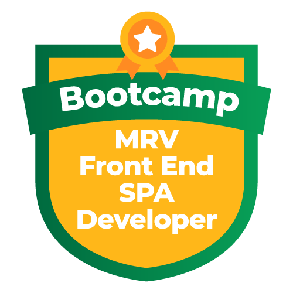

  

<!--About session-->
<h1 align="center">Recriando a Interface do Netflix</h1>

Curso do Bootcamp MRV Front End SPA Developer da [Digital Innovation One](https://digitalinnovation.one/).

Recrie a interface do principal site de streaming mundial utilizando tecnologias simples como HTML5, CSS3 e JavaScript. Nesse projeto você aprenderá: como estruturar um layout, técnicas de CSS3 com containers e variáveis, como posicionar os elementos com Flexbox e como utilizar plugins Jquery a favor da sua aplicação.

As imagens dos filmes incluídos neste projetos foram retiradas do site [The Movie Database - TMDb](https://www.themoviedb.org/). O carousel foi criado através do plugin jQuery [Owl Carousel 2](https://owlcarousel2.github.io/OwlCarousel2/), no site contém vários exemplos de carousel.

Neste projeto realizei algumas alterações que achei melhor.

<h3>Projeto desenvolvido</h3>

<h3>👨‍💻 Tecnologias utilizadas</h3>

- [HTML](https://www.w3schools.com/html/)
- [CSS](https://developer.mozilla.org/pt-BR/docs/Web/CSS)
- [JavaScript](https://developer.mozilla.org/en-US/docs/Web/JavaScript)

<!--License session-->
<h3>📝 Licença</h3>

- Este projeto está sob a licença [MIT](./LICENSE.txt).

<!--Bottom session-->
 <h4 align=center>Made with by <a target="_blank" href="https://github.com/mariacpeixoto" >Maria Peixoto</a></h4>
